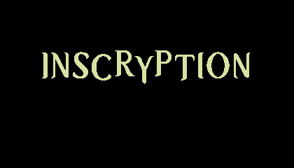

# Inscryption Floppy
An attempt to rewrite Inscryption act 2 in pure C and fit it to 1.44MB floppy disk.

## Resources
Floppy disks have a very limited file name table and strict constraints on directory entries.
Storing hundreds of individual texture files is inefficient and quickly exhausts the available directory space. To solve this, I created `.pak` format.

Instead of storing textures as separate files, all textures are packed into a single .pak archive. Texture file names are hashed to 32-bit integers.

Structure of `.pak` format:
```
[uint32 file count]

.. each file ..
[int32 hash]
[uint32 size]
[file data]
```

**The original game textures are not included in this repository.**

Unfortunately, I cannot distribute them because they are protected by their original license and ownership. If you want to run the project with the original assets, you will need to provide the texture files yourself and generate the `.pak` files locally using the provided packer script (see [ASSETS_TREE.txt](resources/ASSETS_TREE.txt)). This repository **only** contains the engine and tooling code.

## Render
This project does not use any GPU-accelerated API. Instead, it renders directly into a 32-bit software framebuffer in system memory.

All drawing operations (including rectangles, texture blitting, and alpha blending) are performed manually on the CPU.
The final framebuffer is then presented to the window using the Win32 API.

## Limitations
The original game applies several full-screen post-processing effects, including bloom shader, chromatic abberation and vignette. These effects are used to simulate a CRT-style display. This project does not implement full-screen shader-based post-processing.
Since rendering is done entirely in a software framebuffer, reproducing those effects in the same way is outside the scope of this implementation. 

However, nothing prevents you from running this game on an actual CRT monitor or TV ;)

## Screenshots
